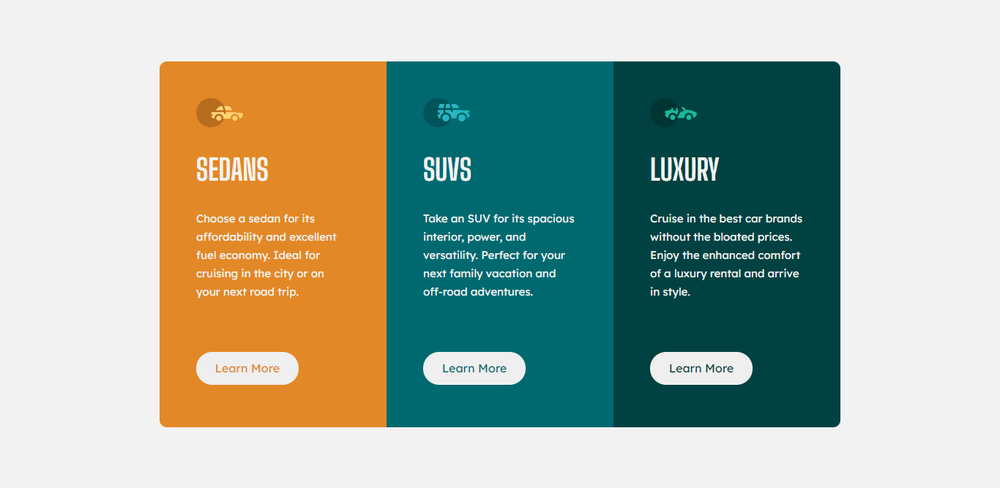

# Desafio - Frontend Mentor - Column Preview Card Component

Esse é um desafio do Frontend Mentor com o objetivo de treinar e desenvolver habilidades nível start numa página responsiva.

### O desafio

Os usuários devem ser capazes de:

- Visualizar o layout ideal para o site, dependendo do tamanho da tela do dispositivo

- Ver estados de foco para todos os elementos interativos na página

  

### Screenshot

### Links

- Solução URL: https://dani-michely-column-preview-card.netlify.app/

## Meu processo

### Construído com

- HTML5

- CSS3

- Flexbox

- Mobile-first

- Media Query

  

## Autora
- Github - https://github.com/danimichelydev
- Frontend Mentor - @danimichelydev
- Linkedin: https://www.linkedin.com/in/dani-michely/

